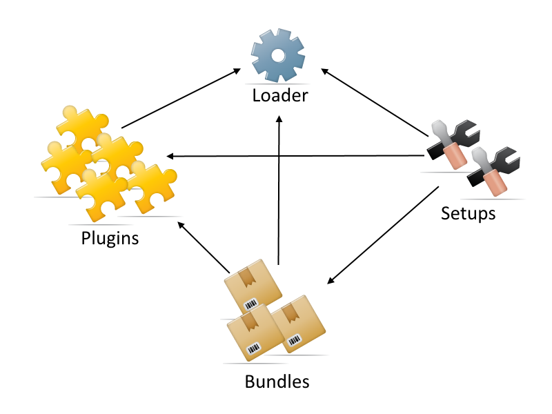

Contao Extension: TinyMcePluginLoader
=====================================

Special extension that will load additional TinyMCE plugins (check out the available plugins: [here](#plugins)).

Now for TinyMCE 4.

Installation
------------

Install the extension via composer: [cliffparnitzky/tiny-mce-plugin-loader](https://packagist.org/packages/cliffparnitzky/tiny-mce-plugin-loader).

If you prefer to install it manually, download the latest release here: https://github.com/cliffparnitzky/TinyMcePluginLoader/releases

Tracker
-------

https://github.com/cliffparnitzky/TinyMcePluginLoader/issues

Compatibility
-------------

- Contao version >= 3.3.0 ... <  3.6.0
- Contao version >= 4.4.0

Dependency
----------

- There are no dependencies to other extensions, that have to be installed.

Components
----------

### Plugins

These are the currently integrated plugins and their respective availability status. The plugins must be installed separately, either individually or via [bundle](#bundles).

| Plugin                                                                               | TinyMCE 3 compatible                                                                   | TinyMCE 4 compatible                                                             |
| ------------------------------------------------------------------------------------ | :------------------------------------------------------------------------------------: | :------------------------------------------------------------------------------: |
| [TinyMceAdvancedList](https://github.com/cliffparnitzky/TinyMceAdvancedList)         |        |  |
| [TinyMceAnchor](https://github.com/cliffparnitzky/TinyMceAnchor)                     |  |  |
| [TinyMceCodeMirror](https://github.com/cliffparnitzky/TinyMceCodeMirror)             |  |  |
| [TinyMceColorpicker](https://github.com/cliffparnitzky/TinyMceColorpicker)           |  |  |
| [TinyMceContextMenu](https://github.com/cliffparnitzky/TinyMceContextMenu)           |        |  |
| [TinyMceEmoticons](https://github.com/cliffparnitzky/TinyMceEmoticons)               |  |  | 
| [TinyMceFontAwesome](https://github.com/cliffparnitzky/TinyMceFontAwesome)           |  |  |
| [TinyMceGoogleMaps](https://github.com/cliffparnitzky/TinyMceGoogleMaps)             |        |  |
| [TinyMceHorizontalRuler](https://github.com/cliffparnitzky/TinyMceHorizontalRuler)   |  |  | 
| [TinyMceImageEnhancement](https://github.com/cliffparnitzky/TinyMceImageEnhancement) |  |  | 
| [TinyMceInsertDateTime](https://github.com/cliffparnitzky/TinyMceInsertDateTime)     |        |  |
| [TinyMceLinkAutoDetect](https://github.com/cliffparnitzky/TinyMceLinkAutoDetect)     |        |  |
| [TinyMceLinkLightbox](https://github.com/cliffparnitzky/TinyMceLinkLightbox)         |  |  | 
| [TinyMceLocalStorage](https://github.com/cliffparnitzky/TinyMceLocalStorage)         |        |  |
| [TinyMcePagebreak](https://github.com/cliffparnitzky/TinyMcePagebreak)               |        |  |
| [TinyMceQuotes](https://github.com/cliffparnitzky/TinyMceQuotes)                     |        |  |
| [TinyMceStrikethrough](https://github.com/cliffparnitzky/TinyMceStrikethrough)       |        |  |
| [TinyMceTextColor](https://github.com/cliffparnitzky/TinyMceTextColor)               |  |  |
| [TinyMceTextPattern](https://github.com/cliffparnitzky/TinyMceTextPattern)           |  |  |
| [TinyMceUnderline](https://github.com/cliffparnitzky/TinyMceUnderline)               |  |  |
| [TinyMceWordCount](https://github.com/cliffparnitzky/TinyMceWordCount)               |        |  |
| [TinyMceYouTube](https://github.com/cliffparnitzky/TinyMceYouTube)                   |        |  |

(More plugins will be added soon. For wishes add a comment to [issue #3](https://github.com/cliffparnitzky/TinyMcePluginLoader/issues/3).)

### Bundles

These are the currently available bundles (packages of plugins) for easier installation via composer:

- [TinyMceBundleAll](https://github.com/cliffparnitzky/TinyMceBundleAll) - installs all available plugins
- [TinyMceBundleClassic](https://github.com/cliffparnitzky/TinyMceBundleClassic) - installs the missing default plugins known from TinyMCE 3
- [TinyMceBundleTextColor](https://github.com/cliffparnitzky/TinyMceBundleTextColor) - installs the text color plugins

### Setups

These are the currently available setups, which redefines the TinyMCE toolbars:

- [TinyMceZUpAll](https://github.com/cliffparnitzky/TinyMceZUpAll) - creates the toolbars with all known buttons
- [TinyMceZUpClassic](https://github.com/cliffparnitzky/TinyMceZUpClassic) - creates the toolbars known from TinyMCE 3

Additional information
----------------------

### Special notes

There is nothing special to pay attention to.

### Information in the wiki

#### Create a new ...

* [Creating a new plugin](https://github.com/cliffparnitzky/TinyMcePluginLoader/wiki/Creating-a-new-plugin)
* [Creating a new bundle](https://github.com/cliffparnitzky/TinyMcePluginLoader/wiki/Creating-a-new-bundle)
* [Creating a new setup](https://github.com/cliffparnitzky/TinyMcePluginLoader/wiki/Creating-a-new-setup)

#### Installation hints
* [Install manually](https://github.com/cliffparnitzky/TinyMcePluginLoader/wiki/Install-manually)

#### Bug report hints

* [Report a bug](https://github.com/cliffparnitzky/TinyMcePluginLoader/wiki/Report-a-bug)
